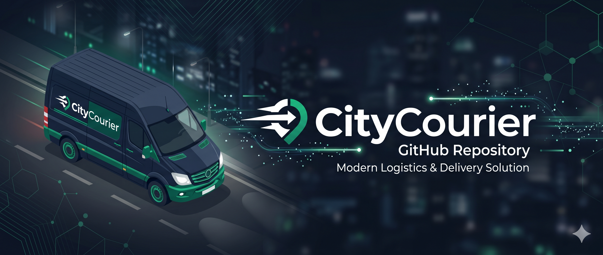

# City Courier - Sistema Integrado de Gestión Logística

> **Proyecto Final - 1º DAM** > Desarrollo de una plataforma web integral para la digitalización y optimización de flotas de reparto urbano, rutas y envíos de paquetería.

El sistema está diseñado para resolver problemas logísticos reales, automatizando la toma de decisiones, previniendo sobrecargas de peso en los vehículos y facilitando el control de tiempos de entrega mediante un sistema de alertas dinámicas en tiempo real.

---

## 📋 Tabla de Contenidos

- [Características Principales](#-características-principales)
- [Tecnologías Utilizadas](#-tecnologías-utilizadas)
- [Arquitectura y Decisiones de Diseño](#-arquitectura-y-decisiones-de-diseño)
- [Puesta en Marcha (Getting Started)](#-puesta-en-marcha-getting-started)
- [Accesos y Roles del Sistema](#-accesos-y-roles-del-sistema)
- [Autor](#-autor)

---

## 🚀 Características Principales

La aplicación está dividida en módulos operativos para cubrir el ciclo de vida completo de la mensajería urbana:

### 1. Operativa de Envíos y Auto-Asignación (Core)
- **Recepción de Envíos:** Registro de nuevos paquetes con destino, peso y niveles de prioridad.
- **Auto-Asignación Inteligente:** Un algoritmo que escanea envíos huérfanos y los asigna automáticamente cruzando datos de:
  - Coincidencia de la **zona de destino** del paquete con la zona de cobertura del repartidor.
  - Validación física en tiempo real del **peso acumulado** frente a la capacidad máxima del vehículo asignado.
- **Asignación Manual Segura:** Intercepta errores humanos lanzando excepciones (`CapacidadExcedidaException`, `RepartidorNoDisponibleException`) si se intenta forzar un paquete a un vehículo lleno o a un repartidor sin ruta activa.

### 2. Monitorización de Tiempos (SLA)
- **Semáforo de Tiempos:** Sistema visual calculado *al vuelo* que evalúa el estado de cada envío comparando la hora actual con el tiempo estimado de la ruta:
  - 🟢 **A Tiempo:** Amplio margen de entrega.
  - 🟠 **En Riesgo:** Menos de 24 horas para la hora límite.
  - 🔴 **Atrasado:** El paquete ha superado su fecha de entrega acordada.

### 3. Gestión de Recursos Humanos y Rutas
- **Gestión de Flota:** Control del ciclo de vida de los trabajadores y sus vehículos.
- **Rutas Dinámicas:** Creación de rutas conectando múltiples puntos de entrega, fechas de inicio/fin y asignación directa a conductores.

---

## 🛠️ Tecnologías Utilizadas

### ⚙️ Backend


### 🎨 Frontend


### 🗄️ Base de Datos & Arquitectura


---

## 🏗️ Arquitectura y Decisiones de Diseño

El proyecto sigue una arquitectura estricta **MVC (Model-View-Controller)**, apoyándose en la Inyección de Dependencias de Spring y aislando la lógica de negocio en la capa de Servicios. La persistencia se maneja mediante Spring Data JPA, utilizando herencia de tablas (`JOINED`) para el control de trabajadores y roles de seguridad.

### Desacoplamiento de Ruta y Asignación (Normalización)
Para mantener la base de datos normalizada y evitar redundancias de datos, se tomó la decisión arquitectónica de **no vincular directamente la entidad `Ruta` con la `Asignación`**. 
En su lugar, la `Ruta` se asocia a un `Repartidor` (1:N), y es este quien se vincula a las `Asignaciones` de los paquetes. Esto garantiza la integridad referencial: un envío asignado a un repartidor pertenece implícitamente a la ruta que este tiene activa, evitando bucles de dependencias o datos desincronizados.

```text
┌──────────────────────────────────────────────────────────┐
│                  ARQUITECTURA DE DATOS                   │
│                                                          │
│  [ Envío ] ─────────────(1:N)─────────────┐              │
│                                           ▼              │
│  [ Ruta ] ──(1:N)── [ Repartidor ] ──(1:N)── [ Asignación ]│
│                                                          │
└──────────────────────────────────────────────────────────┘

La persistencia se maneja mediante Spring Data JPA, utilizando herencia de tablas (`JOINED`) para el control de trabajadores y roles de seguridad.

## ⚙️ Puesta en Marcha (Getting Started)

Sigue estos pasos para desplegar la aplicación en tu entorno local.

### Prerrequisitos
- **Java 21** o superior instalado en el sistema (establecido en el `pom.xml`).
- Entorno de desarrollo compatible (Spring Tool Suite recomendado, IntelliJ IDEA, Eclipse, VS Code).
- Git.

**Dependencias del proyecto (gestionadas automáticamente vía Maven):**
El proyecto está construido sobre **Spring Boot 4.0.6** e incluye los siguientes módulos principales:
- **Spring Web (WebMVC):** Para la arquitectura web y el mapeo de controladores.
- **Spring Data JPA:** Para la capa de persistencia y comunicación con la base de datos mediante Hibernate.
- **Spring Security:** Para la gestión de roles, autenticación y protección de las rutas.
- **Thymeleaf:** Motor de plantillas principal, complementado con **Thymeleaf Extras Spring Security 6** para renderizar elementos de la interfaz en función de los permisos del usuario logueado.
- **Spring Validation:** Para aplicar reglas de negocio y restricciones (`@Valid`) directamente en las entidades y formularios.
- **H2 Database:** Motor de base de datos en memoria y acceso a su consola de administración.
- **Lombok:** Librería para mantener el código limpio mediante la autogeneración de constructores, *getters* y *setters*.

### Instalación y Ejecución

1. **Clonar el repositorio:**
   ```bash
   git clone [https://github.com/davidiazstoica05-ux/TFG-codigo-fuente.git](https://github.com/davidiazstoica05-ux/TFG-codigo-fuente.git)
   cd TFG-codigo-fuente

### Opción 1: Ejecución desde Spring Tool Suite (STS) - Recomendado

Al haber sido el IDE nativo del proyecto, la forma más sencilla de levantarlo es a través de STS:

1. **Clonar e Importar el proyecto:**
   - Clona este repositorio en tu equipo: 
```bash
     git clone [https://github.com/davidiazstoica05-ux/TFG-codigo-fuente.git](https://github.com/davidiazstoica05-ux/TFG-codigo-fuente.git)
     ```
   - Abre STS y dirígete a **File** > **Import...**
   - Selecciona **Maven** > **Existing Maven Projects** y pulsa **Next**.
   - Selecciona la carpeta clonada (`TFG-codigo-fuente`), asegúrate de que el `pom.xml` está marcado y pulsa **Finish**.

2. **Descargar dependencias:**
   - Haz clic derecho sobre el proyecto en el explorador, selecciona **Maven** > **Update Project...** (o `Alt + F5`) y pulsa **OK**.

3. **Arrancar la aplicación:**
   - Utiliza el **Boot Dashboard** (selecciona `City_Courier` y pulsa el botón de **Start/Play**).
   - Alternativamente, haz clic derecho sobre el proyecto > **Run As** > **Spring Boot App**.